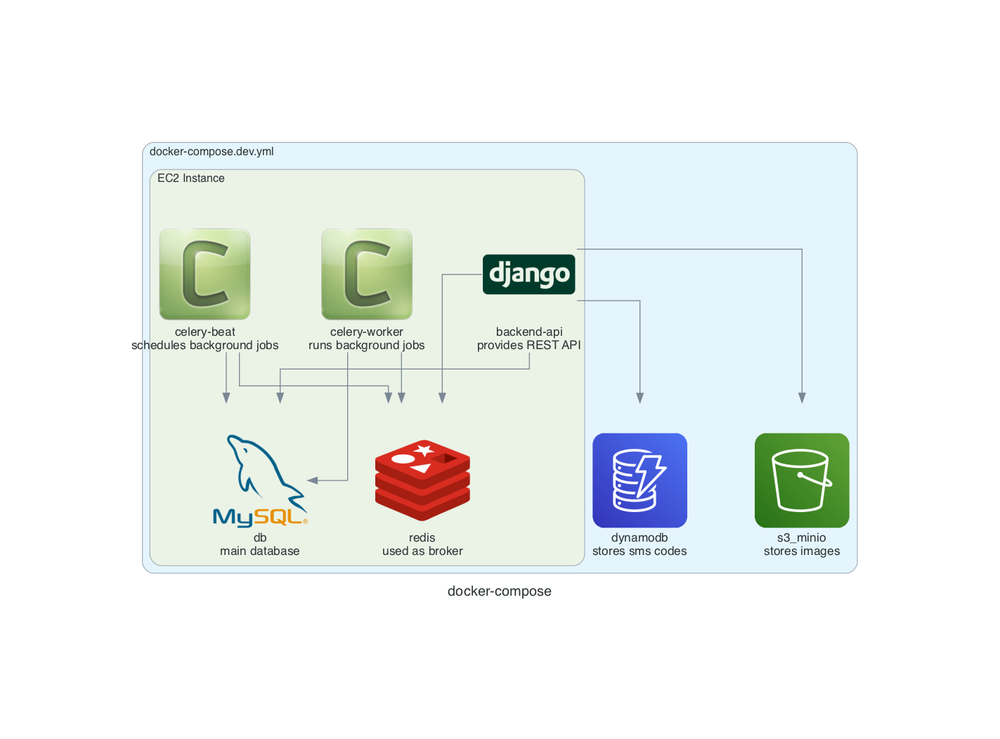

<p align="center">
  
</p>

<h1 align="center">
 docker-compose-diagram
</h1>
<p align="center">
  <a href="https://github.com/docker/compose"> 🐳 docker-compose</a> + 🎨 <a href="https://diagrams.mingrammer.com/">diagrams </a>= docker-compose-diagram 🐳🎨

</p>

## Motivation
This tool combines diagrams package and docker-compose allowing you to create diagrams out of docker-compose files. 
The tool might be helpful for documentation purposes. 

## Installation

Please install [graphviz](https://graphviz.gitlab.io/download/).
Then install this util from pypi via pip or other package manager.
```console
pip install docker-compose-diagram
```

## Usage

```console
compose-diagram --file docker-compose.yml --direction=TB --nodesep=1.2
```


## Example

Let's say we have the following docker-compose file:

<details>
<summary>docker-compose.yml</summary>

```yaml
version: "3.8"

services:

  backend-api:
    build:
      context: ..
      dockerfile: docker/django/Dockerfile
    image: dev_backend
    container_name: dev_backend
    restart: always
    volumes:
      - ..:/app/
    depends_on:
      - db
      - redis
      - dynamodb
      - s3_minio
    working_dir: "/app/backend"
    expose:
      - 8000
    ports:
      - "8000:8000"
    command: runserver
    labels:
      "docker_compose_diagram.icon": "django"
      "docker_compose_diagram.cluster": "EC2 Instance"
      "docker_compose_diagram.description": "provides REST API"


  db:
    container_name: backend_api_db
    image: mysql/mysql-server:8
    volumes:
      - mysql_data:/var/lib/mysql
    restart: unless-stopped
    ports:
      - "3306:3306"
    labels:
      "docker_compose_diagram.icon": "mysql"
      "docker_compose_diagram.cluster": "EC2 Instance"
      "docker_compose_diagram.description": "main database"


  s3_minio:
    image: minio/minio:latest
    container_name: dev_minio
    entrypoint: sh
    command: -c 'minio server /data  --console-address ":9001"'
    ports:
      - "9000:9000"
      - "9001:9001"
    volumes:
      - ./minio_data:/data
    labels:
      "docker_compose_diagram.icon": "s3"
      "docker_compose_diagram.description": "stores images"


  celery-worker:
    container_name: dev_celery_worker
    build:
      context: ..
      dockerfile: docker/django/Dockerfile
    image: dev_backend
    working_dir: /app/backend
    volumes:
      - ..:/app/
    command: celery -A config worker  --autoscale=8,1 -P gevent -l INFO
    restart: unless-stopped
    depends_on:
      - db
      - redis
    labels:
      "docker_compose_diagram.icon": "celery"
      "docker_compose_diagram.cluster": "EC2 Instance"
      "docker_compose_diagram.description": "runs background jobs"


  celery-beat:
    container_name: dev_celery_beat
    build:
      context: ..
      dockerfile: docker/django/Dockerfile
    image: dev_backend
    working_dir: /app/backend
    volumes:
      - ..:/app/
    command: celery -A config beat  -l INFO
    restart: unless-stopped
    depends_on:
      - db
      - redis
    labels:
      "docker_compose_diagram.icon": "celery"
      "docker_compose_diagram.cluster": "EC2 Instance"
      "docker_compose_diagram.description": "schedules background jobs"


  dynamodb:
    command: "-jar DynamoDBLocal.jar -sharedDb -dbPath ./data"
    image: "amazon/dynamodb-local:latest"
    container_name: dev_dynamodb
    ports:
      - "11000:8000"
    volumes:
      - "./dynamodb:/home/dynamodblocal/data"
    working_dir: /home/dynamodblocal
    labels:
      "docker_compose_diagram.description": "stores sms codes"


  redis:
    image: redis:alpine
    container_name: dev_redis
    restart: unless-stopped
    ports:
      - "6379:6379"
    labels:
      "docker_compose_diagram.cluster": "EC2 Instance"
      "docker_compose_diagram.description": "used as broker"


volumes:
  mysql_data:

```

</details>

will create the following `.png` file


## Use cases

* project documentation;
* catching dependencies bugs in your docker-compose file;

